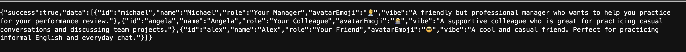

> start: prajith ravisankar, time: Saturday, november 15, 2025 - 7:50 PM

# BACKEND

# setting up Express + MongoDb + GeminiAPI + elevenlabs api for the backend.

- setup server in index.js
- first endpoint with `http://localhost:3001/api/characters` and it returned the output: 

> end: prajith ravisankar, time: Saturday, november 15, 2025 - PM
