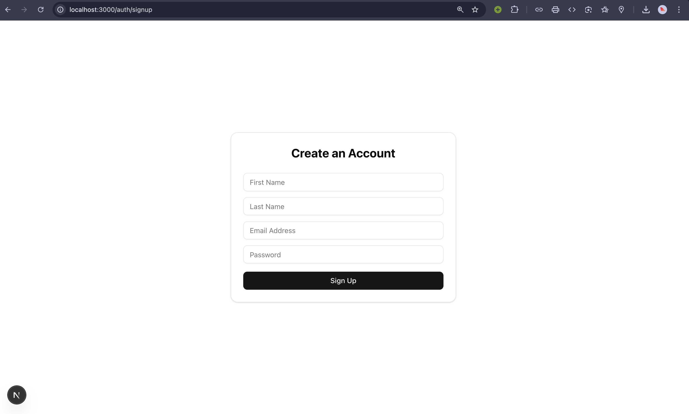
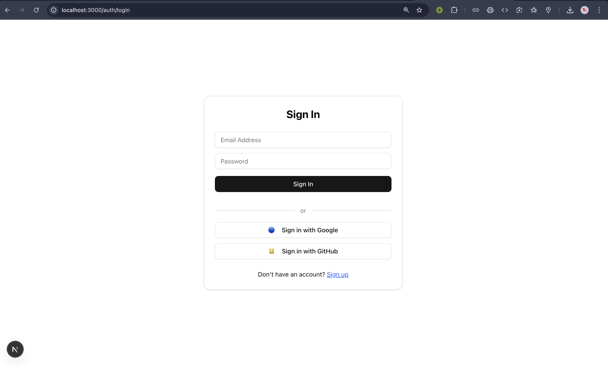
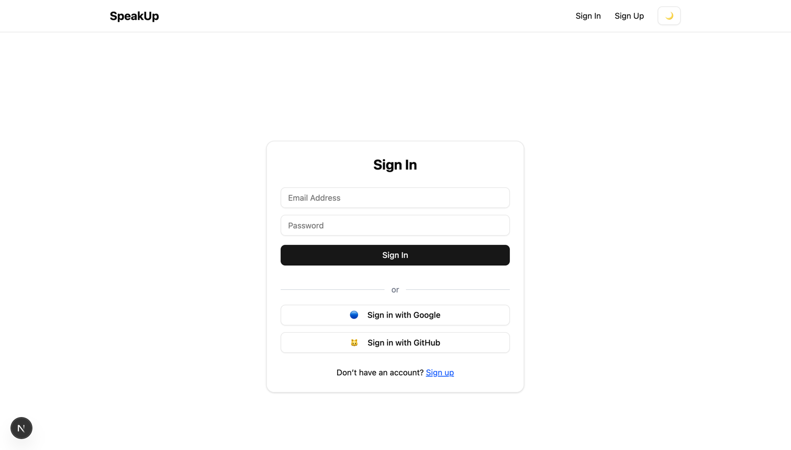
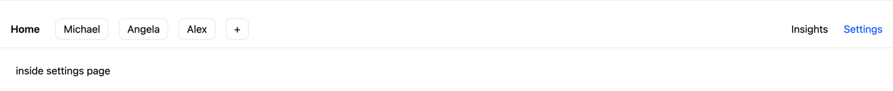
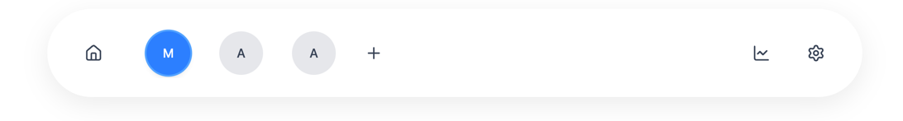

> start: prajith ravisankar, time: Saturday, november 15, 2025 - 1:00 PM

# Frontend

I am not used to frontend, I have experience with react. So all the things in the frontend are done by AI. I am building the backend on my own. 
I have to give credits to gemini-ai for helping me build the frontend, and chatgpt for helping me with some code snippets.
- prajith ravisankar. 

### set up the front end

- going with next js and shadcn for the frontend

### signup/login setup

```js
"use client";

import { useState } from "react";
import { Input } from "@/components/ui/input";
import { Button } from "@/components/ui/button";

export default function SignUpPage() {
  // local form state
  const [form, setForm] = useState({
    firstName: "",
    lastName: "",
    email: "",
    password: "",
  });

  // placeholder for submit later (backend not built yet)
  function handleSignup() {
    console.log("User submitted:", form);
  }

  return (
    <div className="flex justify-center items-center min-h-screen px-4">
      <div className="w-full max-w-md border p-6 rounded-xl shadow-sm">
        {/* Page Title */}
        <h1 className="text-2xl font-bold mb-6 text-center">
          Create an Account
        </h1>

        {/* First Name */}
        <Input
          placeholder="First Name"
          className="mb-3"
          value={form.firstName}
          onChange={(e) => setForm({ ...form, firstName: e.target.value })}
        />

        {/* Last Name */}
        <Input
          placeholder="Last Name"
          className="mb-3"
          value={form.lastName}
          onChange={(e) => setForm({ ...form, lastName: e.target.value })}
        />

        {/* Email */}
        <Input
          placeholder="Email Address"
          className="mb-3"
          type="email"
          value={form.email}
          onChange={(e) => setForm({ ...form, email: e.target.value })}
        />

        {/* Password */}
        <Input
          placeholder="Password"
          className="mb-4"
          type="password"
          value={form.password}
          onChange={(e) => setForm({ ...form, password: e.target.value })}
        />

        {/* Submit Button */}
        <Button className="w-full" onClick={handleSignup}>
          Sign Up
        </Button>
      </div>
    </div>
  );
}
```

- setting up the sign up page first, going with basic sign up page.

  - cd ~/speakUp/frontend/app/auth/signup and ran npm run dev and it is showing the rendered page - cool : 

- setup login page, just modified some fields from signup page.
  - tested: 

### navigation bar setup

```typescript
// --------------------------
// NAVBAR COMPONENT
// File: components/navbar.tsx
// --------------------------

"use client";

import Link from "next/link";
import { ModeToggle } from "@/components/mode-toggle";

export function Navbar() {
    return (
        <nav className="w-full border-b bg-background">
            <div className="max-w-5xl mx-auto flex items-center justify-between px-4 py-3">

                {/* Logo */}
                <Link href="/" className="text-xl font-bold">
                    SpeakUp
                </Link>

                {/* Navigation Links */}
                <div className="flex items-center gap-6 text-sm">
                    <Link href="/auth/login">Sign In</Link>
                    <Link href="/auth/signup">Sign Up</Link>

                    {/* Dark/Light Mode Toggle */}
                    <ModeToggle />
                </div>

            </div>
        </nav>
    );
}
```

- testing: 

### once login/signup is done, a chat page should be shown

- kindly refer to [frontend/components/chat-navbar.tsx](components/chat-navbar.tsx), and all the folders and files inside app > app to check how our special chat navigator bar is setup.
- testing screenshots: 

### basic style change for nav bar

- testing: 

### Home page setup

- 

> end: prajith ravisankar, time: Saturday, november 15, 2025 - 5:28 PM
---
